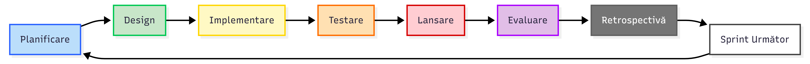
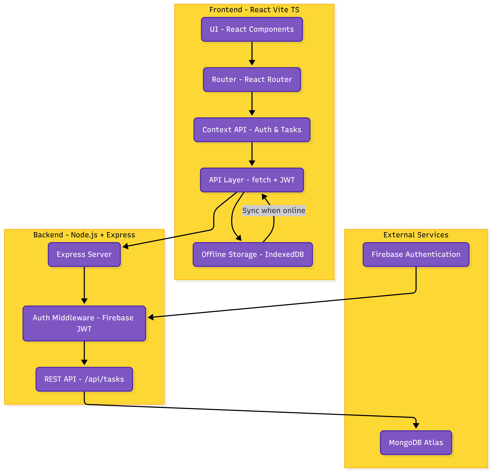
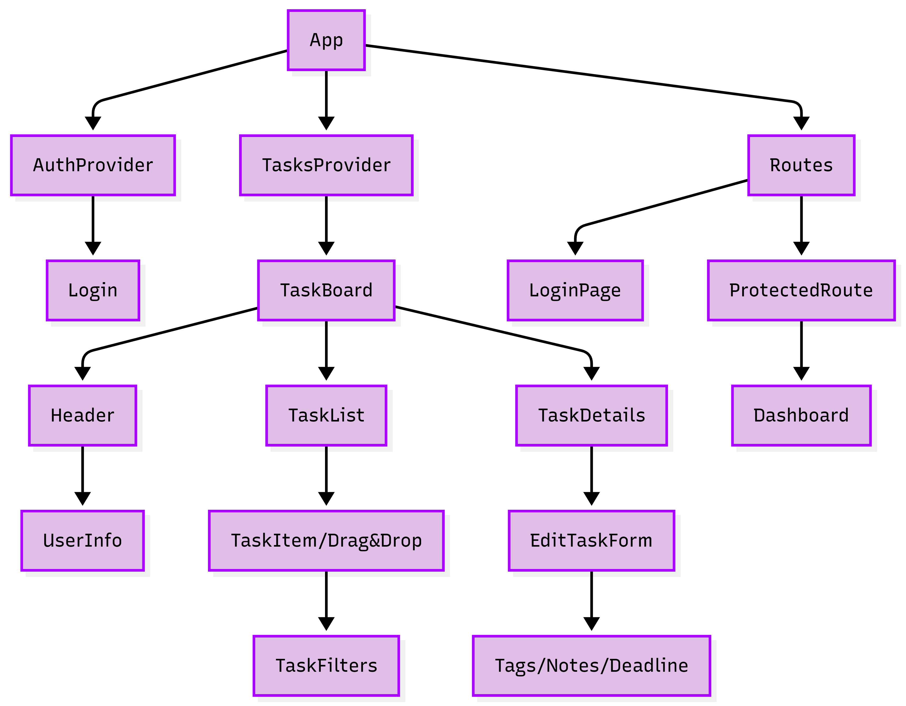

# List Of Tasks -- Documentație Tehnică

# Studenți:

Andone Andrei
Țurcă Cosmin-Constantin

# 1. Prezentare Generală

Aplicația List Of Tasks este o platformă web dedicată gestionării eficiente a sarcinilor și activităților, având ca scop îmbunătățirea productivității utilizatorilor. Proiectul este construit pe stack-ul MERN (MongoDB, Express.js, React.js, Node.js), oferind o soluție modernă, rapidă și scalabilă.

Codul sursă este organizat în două directoare principale:

- **Backend:** API-ul serverului și logica de bază de date.

- **Frontend:** Interfața utilizator reactivă.

# 2. Obiective Tehnice

- **Arhitectură Modernă:** Utilizarea React împreună cu Vite pentru o performanță optimă a frontend-ului.

- **Design Responsive & Modern:** Implementarea interfeței grafice folosind Tailwind CSS, asigurând un design utilitar, consistent și adaptabil pe orice dispozitiv (mobil, tabletă, desktop).

- **Interactivitate:** Feedback vizual imediat la acțiunile utilizatorului (adăugare, ștergere, completare task).

- **API RESTful:** Arhitectură backend standardizată pentru gestionarea resurselor de tip Task.

- **Persistența Datelor:** Salvarea sigură a informațiilor utilizând baza de date non-relațională MongoDB.

# 3. Funcționalități

- **Gestiunea Sarcinilor (CRUD):** Utilizatorii pot crea sarcini noi, vizualiza lista completă, edita detaliile și șterge sarcinile care nu mai sunt necesare.

- **Mark as Completed:** Funcționalitate de tip "toggle" pentru a marca o sarcină ca fiind finalizată sau în desfășurare.

- **Interfață Dinamică:** Actualizarea listei de sarcini în timp real fără reîncărcarea paginii.

- **Design Adaptiv:** Layout flexibil realizat cu clasele utilitare Tailwind.

- **Mod Offline (Offline-First):** Aplicația funcționează și fără internet, salvând datele local și sincronizându-le automat când revine conexiunea.

# 4. Tehnologii Utilizate

**Frontend**

- **React (Vite)** + **TypeScript**.

- **Tailwind CSS** (folosit pentru stilizare rapidă, sistem de grid/flexbox și design responsive).

- **React Router DOM:** Pentru gestionarea rutelor și navigarea în aplicație (SPA - Single Page Application).

- **Axios / Fetch API:** Pentru realizarea cererilor HTTP către backend.

**Backend**

- **Node.js & Express.js:** Arhitectură server-side modulară.

- **Firebase Admin SDK:** Bibliotecă utilizată pe server pentru verificarea integrității token-urilor JWT primite de la client.

- **Mongoose:** Modelarea datelor (Schema) pentru interacțiunea cu MongoDB.

- **Input Validation:** Strat dedicat de validare a datelor primite (Request Body) pentru a asigura integritatea informațiilor înainte de procesare.

- **Middleware:** Funcții intermediare pentru gestionarea autentificării și a erorilor.

**Stocare**

- **MongoDB:** Bază de date NoSQL.

- **Mongoose:** ODM (Object Data Modeling) pentru modelarea structurii datelor (Schema) și validare.

# 5. Metodologie Agile

Proiectul a fost dezvoltat urmând o abordare iterativă, structurată în Sprint-uri:

**Sprint 1: MVP & Arhitectură (Core)**

- **Planificare & Design:** Definirea structurii de date (Schema) și a design-ului UI în Tailwind CSS.

- **Implementare:** Configurarea mediului (Vite + TypeScript), implementarea autentificării cu Firebase și a operațiilor de bază (CRUD) pentru task-uri.

- **Evaluare:** Testarea fluxului de login și a conectivității cu baza de date MongoDB.

**Sprint 2: Funcționalități Avansate (Offline First)**

- **Planificare:** Analiza cerințelor pentru persistența datelor fără internet.

- **Implementare:** Integrarea IndexedDB pentru stocare locală și sincronizarea automată cu backend-ul la reconectare. Adăugarea filtrelor și a categoriilor.

- **Testare:** Verificarea scenariilor "Offline" și a consistenței datelor.

**Sprint 3: UI/UX & Export**

- **Design:** Rafinarea interfeței.

- **Implementare:** Adăugarea funcțiilor de Export (PDF, CSV, Excel) și Import.

- **Lansare & Retrospectivă:** Optimizarea build-ului pentru producție (Vercel).

## Development Flow

## Application Architecture

## React Components Architecture

# 8. Documentație API

Toate rutele sunt protejate și necesită autentificare prin Header-ul Authorization.

**GET /api/tasks** Returnează lista sarcinilor asociate exclusiv utilizatorului autentificat.

**GET /api/tasks/:id** Returnează detaliile unei singure sarcini pe baza ID-ului (doar dacă aparține utilizatorului).

**POST /api/tasks** Creează o nouă sarcină validată. Body: { title, description, priority, deadline, category }.

**PUT /api/tasks/:id** Actualizează o sarcină existentă (modificare status, conținut sau prioritate).

**DELETE /api/tasks/:id** Șterge permanent o sarcină din baza de date.

# 9. Rute Frontend

**Rute Publice:** /login – Pagina de autentificare. Dacă utilizatorul este deja logat, este redirecționat automat către Dashboard.

**Rute Protejate (Private):**/ (Root) încarcă componenta \<TaskBoard /\>.

# 10. Concluzii

List Of Tasks demonstrează capacitatea de a construi o aplicație Full Stack funcțională și estetică. Utilizarea Tailwind CSS a permis o dezvoltare rapidă a interfeței, în timp ce arhitectura MERN asigură performanță și scalabilitate. Proiectul este pregătit pentru extinderi viitoare.